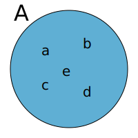
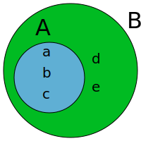

# Conjuntos e operações

Em Matemátemática, utilizamos _sistemas axiomáticos_. Nesses sistemas, temos algumas _noções elementares_, que são coisas que não definimos e _axiomas_, que são as regras que escolhemos como válidas dentro desse sistema. 

Na Teoria dos Conjuntos, as noções elementares são:
- conjunto
- elemento
- pertinência

Nossa noção de conjunto em matemática é a mesma da linguagem coloquial: um agrupamento de coisas. Essas coisas que compõe o conjunto são os elementos desse conjunto. Quando um elemento faz parte de um conjunto, dizemos que ele _pertence_ ao conjunto.

**Exemplos**

- O conjunto das vogais: a, e, i, o, u
- O conjunto de alunos do PIAPE
- O conjunto de alunos da UFSC Blumenau
- O conjunto dos números pares: 0, 2, 4, 6, 8,...

## Pertinência

Quando queremos dizer que um elemento pertence a um conjunto, utilizamos o símbolo $\in$. Quando queremos dizer que um elemento não pertence a um conjunto, utilizamos $\notin$.
Assim, $$a\in \text{conjunto das vogais}$$
$$c \notin \text{conjunto das vogais}$$
$$0\in \text{conjunto dos números pares}$$
$$1\notin \text{conjunto dos números pares}$$

## Convenção

Uma ==convenção== é um acordo. A convenção geral é que utilizamos letras minúsculas para denotar os elementos e letras maiúsculas para denotar os conjuntos. 
- $a, b, c$ são elementos
- $A, B, C$ são conjuntos

## Definindo um conjunto

Podemos definir um conjunto de duas maneiras:
- Enumerando seus elementos
- Descrevendo uma propriedade que seus elementos possuem

Em ambos os casos, utilizamos as chaves $\\{\\}$ para delimitar um conjunto.

**Exemplo**

- O conjunto das vogais podemos enumerar como $$V=\{a,e,i,o,u\}$$
Sempre enumeramos os elementos de um conjunto entre chaves $\{\}$. Assim, para dizer que "a" é uma vogal, podemos denotar por $a\in V$.
- O conjunto dos números pares podemos descrever como
$$P = \{ n \text{ é um número par} \}$$

## Conjunto unitário e vazio

Existe um conjunto que não possui nenhum elemento. Esse conjunto é chamado de _conjunto vazio_, e denotado pelo símbolo $\emptyset$.

Um _conjunto unitário_ é um conjunto que possui apenas um elemento. 

**Exemplo**:  o conjunto de tutores de matemática do PIAPE no campus Blumenau possui um único elemento.

## Conjunto universo

Quando estamos trabalhando em um problema, geralmente consideramos um _conjunto universo_, que é o conjunto de todos os elementos que podemos considerar no contexto estudado.

## Subconjuntos

Dizemos que um conjunto $A$ é _subconjunto_ de $B$ se todo elemento de $A$ também pertence a $B$. Nesse caso, utilizamos a notação $A \subseteq B$.

**Exemplo**
- Seja $A = \{a,b,c\}$ e $B = \{a,b,c,d,e\}$. Note que todo elemento de $A$ também percente a $B$, logo $A \subseteq B$.
- Seja $P = \{ n \text{ é um número par} \}$ e $D = \{ n \text{ é um número múltiplo de 10} \}$. Como todo número múltiplo de 10 também é par, podemos escrever $D \subseteq P$.

**Contra-exemplos**

- Se $A = \{a,e,i,o,u\}$ e $B = \{a,b,c,d,e\}$, note que nem todo elemento de $A$ pertence a $B$. Nesse caso, $A$ **não é** um sonjunto de $B$, e denotamos esse fato escrevendo $$A\not\subseteq B$$
- Seja $P = \{ n \text{ é um número par} \}$ e $C = \{ n \text{ é um número múltiplo de 5} \}$. Nesse caso, $5\in C$, porém $5\not\in P$. Assim, $C$ não pode ser um subconjunto de $P$, e denotamos por $C\not\subseteq P$.

## Diagramas de Venn

Podemos representar conjuntos de maneira visual. Para isso, utilizamos diagramas de Venn. 

Podemos representar o conjunto $A = \{a,b,c,d,e\}$ listando seus elementos e agrupando eles dentro de um círculo, como abaixo

Se quisermos representar o conjunto $A = \{a,b,c\}$ juntamente com o conjunto $B = \{a,b,c,d,e\}$, podemos representar todos os elementos e depois circular os que pertencem a $A$ e os que pertencem a $B$.

Agora temos uma maneira visual de entender que $A\subseteq B$.

Se quisermos representar o conjunto $A = \{a,e,i,o,u\}$ juntamente com o conjunto $B = \{a,b,c,d,e\}$, podemos representar todos os elementos e depois circular os que pertencem a $A$ e os que pertencem a $B$.

## Operações com conjuntos

Dados dois ou mais conjuntos, podemos criar novos conjuntos a partir deles.

### União

Podemos reunir todos os elementos de um conjunto pela união. Utilizamos o símbolo $\cup$.

> $A\cup B$ = { elementos que pertencem a $A$ ou pertencem a $B$ }

Podemos a representação utilizando diagramas de Venn é a seguinte:

### Interseção

Podemos considerar apenas os elementos que estão nos dois conjuntos ao mesmo tempo. Utilizamos o símbolo $\cap$.

> $A\cap B$= { elementos que pertencem a $A$ e também pertencem a $B$ }

Podemos visualizar da seguinte forma

### Diferença

Podemos considerar apenas os elementos que estão nos dois conjuntos ao mesmo tempo. Utilizamos o símbolo $\setminus$.

> $A\setminus B$ = { elementos que pertencem a $A$   e não pertencem a $B$ }

Podemos visualizar da seguinte forma

 
 

## Número de elementos

Quando temos um conjunto $A$, representamos o número de elementos dele por $|A|$.

Temos uma fórmula que relaciona o número de elementos de dois conjuntos com o o número de elementos de sua união.

$$|A\cup B| = |A| + |B| - |A\cap B| $$

 - [Slides :material-presentation-play:](./aula01-slides.md)
 - [Exercícios :writing_hand:](./questoes01.pdf)

