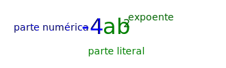

# Expressões algébricas e seus elementos

Expressões algébricas nada mais são do que as "continhas com letras".

## Expressões numéricas

São expressões matemáticas que envolvem operações com números.

$$3+4\times 5^2$$

## Expressões algébricas

São expressões matemáticas que envolvem operações com números e letras

$$3a + b^2 - 5c$$

As letras são chamadas _variáveis_ e numa expressão algébrica, ocupam o lugar de um número. 

Na expressão acima
- O número 3 está multiplicando o número $a$
- O número $b$ está sendo elevado ao quadrado
- O número 5 está multiplicando o número $c$

## Ordem das operações

Nas operações com expressões numéricas ou algébricas, devemos obedecer à seguinte ordem:

1. Potenciação ou Radiciação
2. Multiplicação ou Divisão
3. Adição ou Subtração
4. Quanto tivermos duas expressões com mesma ordem de prioridade, seguimos a ordem da esquerda pra direita.

Notas quanto à prioridade:

1. Antes de cada uma das três operações citadas, deve-se realizar a operação que estiver dentro dos parênteses, colchetes ou chaves.
2. A multiplicação pode ser indicada por $\times$  ou por um ponto $\cdot$ ou às vezes sem sinal, desde que fique clara a intenção da expressão.
3. Muitas vezes devemos usar parênteses quando substituímos variáveis por valores negativos.

## Valor numérico de uma expressão algébrica

As letras servem como abstrações para números. Quando substituímos as letras por valores numéricos, obtemos uma expressão numérica e podemos calcular seu valor.

**Exemplo**

Na expressão algébrica

$$a\div b \cdot(2+c)$$

ao substituirmos o valor de $a$ por 8, $b$ por 2 e $c$ por 2, obtemos a expressão expressão numérica 

$$8\div2\cdot(2+2)$$

cujo valor é 16.

## Elementos de uma expressão algébrica

Na expressão $$3ab$$ a parte _numérica_ é o 3 e a parte _literal_ é o termo ab. Quando uma expressão aparece assim, com números e letras justapostos, subentende-se que existe uma multiplicação entre todos os termos. Assim, a expressão acima equivale a $$3\cdot a \cdot b$$

Na expressão $$-4ab^2$$ o único termo sendo elevado ao quadrado é a variável $b$. Nesse caso, chamamos o 2 de _expoente_ de $b$. Note que a variável $a$ não tem nenhum _expoente_, e nesse caso, subentende-se que o expoente é 1.  Então, a expressão acima equivale a $$-4\cdot a^1 \cdot b^2$$

## Operações com expressões algébricas

### Adição e subtração

Se as partes literais de duas expressões algébricas forem _idênticas_, podemos adicionar/subtrair suas partes numéricas:

$$ 4ab^2c + 7ab^2c = 11ab^2c$$

$$ -3xy + 4xy = 1xy $$

Se as partes literais não forem indêntidas, não podemos fazer nada a não ser escrever uma expressão seguida da outra

$$  4ab^2c + 7a^2bc $$

$$ -3xy + 4yx = 1xy $$

Note que, pela comutatividade, $xy = x\cdot y = y\cdot x = yx$.

### Multiplicação

A multiplicação pode ser feita sem nenhuma restrição: basta multiplicar a parte numérica e somar os expoentes das variáveis das partes literais.

$$ 2ab^2\ \cdot \ 3a^2b = 6 a^3b^3$$

$$ -1a^2b\ \cdot \ 4 ab^3c = -4 a^3b^4c $$ 

Note que a variável $c$ não aparece na primeira expressão, mas aparece no resultado. 

---

 - [Slides :material-presentation-play:](./aula02-slides.md)
 - [Exercícios :writing_hand:](./questoes02.pdf)

