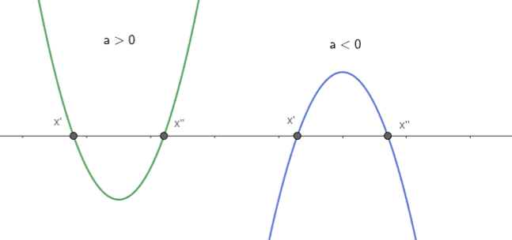

# Inequações de segundo grau

São um caso particular de inequação-produto que pode ser resolvido de maneira mais prática.

$$ax^2+bx+c < 0$$

Basta lembrar que o gráfico de uma equação do segundo grau é uma parábola. 

O gráfico é voltado para cima ou para baixo, a depender do sinal do termo $a$, e corta o eixo $x$ em até dois pontos distintos (as raízes do polinômio).

Assim, para resolver uma desigualdade do segundo grau, basta:

1. Encontrar suas raízes (seja por Bhaskara, soma e produto);
2. Prestar atenção ao sinal de $a$;
3. Fazer o diagrama do sinal;

## Exemplos

1. $ x^2 - x -6  < 0$
2. $ -x^2 + 4x - 4 \ge 0$
3. $ x^2 + x + 1 < 0 $

---

 - [Slides :material-presentation-play:](./aula04-slides.md)
 - [Exercícios :writing_hand:](./questoes04.pdf)

