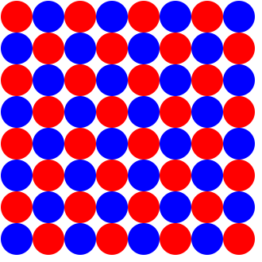

# O jogo da matemática

Imagine o seguinte jogo de tabuleiro: 
- o tabuleiro é formado por 64 círculos, arranjados em uma grade 8 x 8;
- os círculos tem cores alternadas entre vermelho e azul; 

- O jogo é jogado por 2 jogadores, cada um recebendo um conjunto de peças de uma das cores amarela ou roxa. 
- Cada jogador recebe 16 peças, que são:
    - 8 ratos
    - 2 cavalos
    - 2 lobos
    - 2 elefantes
    - 1 tigre
    - 1 leão
- Os jogadores sentam de frente um para o outro e o tabuleiro é posicionado de maneira que o círculo no canto inferior direito de cada jogador seja vermelho.
- Cada jogador posiciona as peças da seguinte maneira:
    - Na fileira inferior a ordem é elefante, cavalo, lobo, tigre, leão, lobo, cavalo, elefante
    - Na fileira a frente dela, posicionam-se os 8 ratos. 

- Movimento das peças: cada peça se movimenta de uma determinada maneira no tabuleiro. O objetivo da movimentação é capturar as peças do adversário. 
    - ratos: movem-se 1 casa para a frente, e capturam peças adversárias movendo-se 1 casa na diagonal. Na primeira jogada, podem mover-se 2 casas para frente;
    - cavalos: movem-se 2 casas para frente, e 1 casa para o lado, um movimento em L;
    - lobos: movem-se quantas casas quiser na diagonal;
    - elefantes: movem-se quantas casas quiser em uma direção, seja vertical ou horizontal;
    - tigre: move-se quantas casas quiser em qualquer direção, seja vertical, horizontal ou diagonal;
    - leão: move-se 1 casa em qualquer direção, seja vertical, horizontal ou diagonal;
- O jogador com as peças amarela inicia jogando;
- O objetivo é capturar o leão do adversário;

