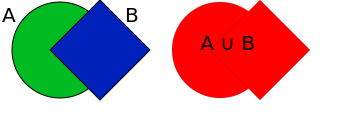
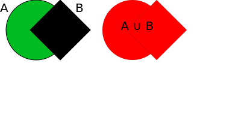
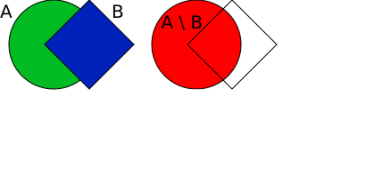
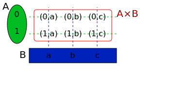

# Operações com conjuntos

Dados dois conjuntos, podemos criar novos conjuntos a partir deles. 

## União

Podemos reunir todos os elementos de um conjunto pela união. Utilizamos o símbolo $\cup$.

$$A\cup B = \{ \text{elementos que pertencem a } A \textbf{ ou }\text{ pertencem a }B\}$$

Podemos a representação utilizando diagramas de Venn é a seguinte:

## Interseção

Podemos considerar apenas os elementos que estão nos dois conjuntos ao mesmo tempo. Utilizamos o símbolo $\cap$.

$$A\cap B = \{ \text{elementos que pertencem a } A \textbf{ e } \text{também pertencem a }B \}$$

Podemos visualizar da seguinte forma:

## Diferença

Podemos considerar apenas os elementos que estão nos dois conjuntos ao mesmo tempo. Utilizamos o símbolo $\setminus$.

$$A\setminus B = \{ \text{elementos que pertencem a } A  \textbf{ e não } \text{pertencem a } B \}$$

Podemos visualizar da seguinte forma:

## Número de elementos

Quando temos um conjunto $A$, representamos o número de elementos dele por $\#A$.

Temos uma fórmula que relaciona o número de elementos de dois conjuntos com o o número de elementos de sua união.

$$\#(A\cup B) = \#A + \#B - \#(A\cap B) $$

## Produto cartesiano

Dados dois elementos $a$ e $b$ de um conjunto universo, podemos criar um novo objeto matemático chamado _par ordenado_, denotado por $(a,b)$. Num par ordenado, a ordem importa: o par $(a,b)$ é diferente do par $(b,a)$. 

Dados os conjuntos $A$ e $B$, o produto cartesiano desses conjuntos é o conjunto de _todos_ os pares ordenados que podemos criar escolhendo um elemento de $A$ para ser o primeiro elemento do par e escolhendo um elemento de $B$ para ser o segundo elemento do par. Utilizamos o símbolo $\times$.

$$A\times B = \{(a,b) \text{ com } a\in A \text{ e com } b\in B \}$$

A melhor maneira de representar um produto cartesiano é como uma grade.

