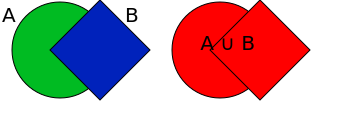
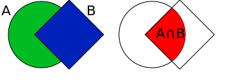
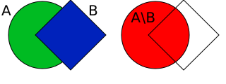

# Operações com conjuntos

Dados dois conjuntos, podemos criar novos conjuntos a partir deles. 

## União

Podemos reunir todos os elementos de um conjunto pela união. Utilizamos o símbolo $\cup$.

$$A\cup B = \{ \text{elementos que pertencem a } A \textbf{ ou }\text{ pertencem a }B\}$$

Podemos a representação utilizando diagramas de Venn é a seguinte:

## Interseção

Podemos considerar apenas os elementos que estão nos dois conjuntos ao mesmo tempo. Utilizamos o símbolo $\cap$.

$$A\cap B = \{ \text{elementos que pertencem a } A \textbf{ e } \text{também pertencem a }B \}$$

Podemos visualizar da seguinte forma:

## Diferença

Podemos considerar apenas os elementos que estão nos dois conjuntos ao mesmo tempo. Utilizamos o símbolo $\setminus$.

$$A\setminus B = \{ \text{elementos que pertencem a } A  \textbf{ e não } \text{pertencem a } B \}$$

Podemos visualizar da seguinte forma:

 
